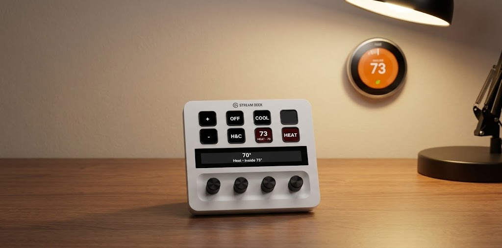
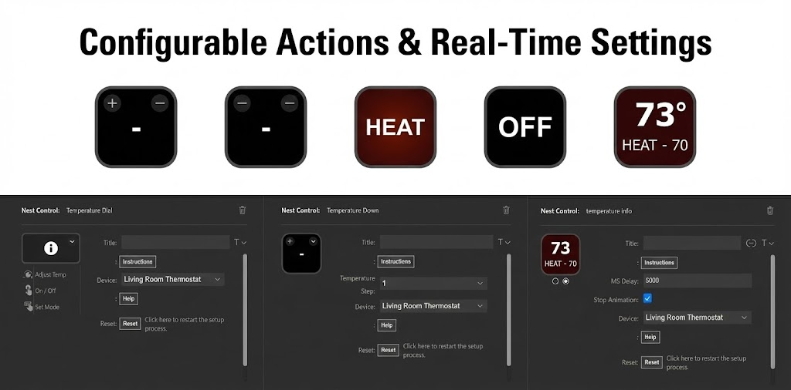
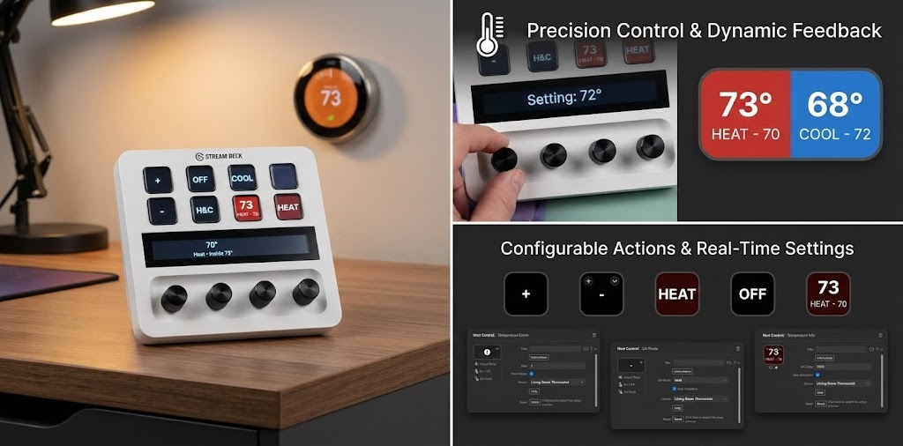

NestControl
====

The Nest Control plugin allows you to integrate your [Google Nest](https://store.google.com/us/category/connected_home?) devices with Stream Deck. This integration uses the [Smart Device Management](https://developers.google.com/nest/device-access/api) API and Google’s Cloud Pubsub to efficiently listen for changes in device state or other events. See [Supported Devices](https://developers.google.com/nest/device-access/supported-devices) for all devices supported by the SDM API.

  
  
  

There is currently only support for climate control devices like the Nest Thermostat.

You are in control of the information and capabilities exposed to Nest Control. You can authorize a single device or multiple devices.

`The Nest Smart Device Management (SDM) API requires a US$5 fee. (Paid To Google)`

Special Thanks to naethure for adding support for the original Heat + Cool

## What NestControl does

- Adjust heating and cooling set points from Stream Deck keys or the Stream Deck + touch display.
- Toggle thermostat modes (Heat, Cool, Heat + Cool, or Off) and see color-coded feedback at a glance.
- Surface ambient temperature and set points directly on the device without opening the Google Home app.

## Controls and how to use them

After setup is complete and a thermostat is selected, these actions are available:

### Thermostat Info (Key)

- Cycles between the current ambient temperature and the thermostat set point every few seconds, matching Nest colors (blue for Cool, red for Heat, purple for Heat + Cool).
- Use the static view if you prefer a single combined readout with no animation; the key still updates whenever Nest reports a change.
- The key refreshes automatically in response to Nest events, so it stays in sync without extra presses.

### Temperature Up (Key)

- Raises the thermostat set point by the step you choose (1/2/5). In Heat + Cool mode, both targets move together to keep the band aligned.
- If the thermostat is Off, the first press switches to Heat to bring the system online before applying the change.
- Press deliberately; Google enforces low rate limits, so rapid tapping may be throttled.

### Temperature Down (Key)

- Lowers the set point by the selected step; in Heat + Cool, both targets drop together.
- If the thermostat is Off, the first press switches to Cool to wake the system up.
- Avoid spamming presses to stay under Google's rate limits.

### Set Mode (Key)

- Acts as a dedicated mode toggle for Heat, Cool, Heat + Cool, or Off (choose the variant you want on the key).
- When the key is in State 0 it shows the mode it will enable. State 1 lights up (blue/red/purple) while that mode is active; pressing again turns the thermostat Off.

### Thermostat Dial (Stream Deck +)

- Rotate the dial to nudge the current set point (or both Heat and Cool targets together in Heat + Cool). Keep turning to fine tune; when you stop, Nest Control applies the new target and confirms on the touch display.
- Press the dial to open a quick mode picker; rotate to choose Heat, Heat + Cool, Cool, or Off, then press again to apply.
- Hold the dial press for about 3 seconds to turn the thermostat Off from anywhere. If the thermostat is Off, rotating shows a prompt to pick a mode first.

Device Access Registration
---------------------------------------------------------

For the first phase, you will turn on the API and create the necessary credentials to have Nest Control talk to the Nest API.

## Create and configure Cloud Project [Cloud Console]

By the end of this section you will have a Cloud Project with the necessary APIs enabled

1. Go to the [Google Cloud Console](https://console.developers.google.com/apis/credentials).

2. If this is your first time here, you likely need to create a new Google Cloud project. Click **Create Project** then **New Project**.

   

3. Give your Cloud Project a name then click **Create**.

4. Go to [APIs & Services > Library](https://console.cloud.google.com/apis/library) where you can enable APIs.

5. From the API Library search for [Smart Device management](https://console.cloud.google.com/apis/library/smartdevicemanagement.googleapis.com) and click **Enable**.

   

6. From the API Library search for [Cloud Pub/Sub API](https://console.developers.google.com/apis/library/pubsub.googleapis.com) in the Cloud Console and click **Enable**.

7. Go to the [Google Cloud Console Dashboard](https://console.cloud.google.com/)

8. Here you will see your Cloud Project Id. Copy it and place it into the Nest Control configuration

   

You now have a cloud project ready for the next section to configure authentication with OAuth.

## Configure OAuth Consent screen [Cloud Console]

By the end of this section you will have configured the OAuth Consent Screen, needed for giving Nest Control access to your cloud project.

1. Go to the [Google API Console](https://console.developers.google.com/apis/credentials).

2. Click [OAuth consent screen](https://console.cloud.google.com/apis/credentials/consent).

3. Click **Get Started** and enter a name / email then click next.

4. Select **External** (the only choice if you are not a G-Suite user) then click **Create**. While you are here, you may click the *Let us know what you think* to give Google’s OAuth team any feedback about your experience configuring credentials for self-hosted software. They make regular improvements to this flow and appear to value feedback.

   

5. The **App Information** screen needs you to enter an **App name** and **User support email**, then enter your email again under **Developer contact email**. These are only shown while you later go through the OAuth flow to authorize Nest Control to access your account. Click **Save and Continue**. Omit unnecessary information (e.g. logo) to avoid additional review by Google.

6. Navigate to the audience tab and click **Publish App** to set the Publishing status to **In Production**.

   

7. The warning says your *app will be available to any user with a Google Account* which refers to the fields you entered on the *App Information* screen if someone finds the URL. This does not expose your Google Account or Nest data.

8. Make sure the status is not *Testing*, or you will get logged out every 7 days.

## Configure OAuth Client Id and Client Secret [Cloud Console]

By the end of this section you will have the `client_id` and `client_secret` which you need to add to the plugin configuration.

The steps below use Web Application Auth with Nest Control to handle Google’s strict URL validation rules.

1. Navigate to the [Credentials](https://console.cloud.google.com/apis/credentials) page and click **Create Credentials**.

   

2. From the drop-down list select **OAuth client ID**.

   

3. Enter **Web Application** for the Application type.

4. Pick a name for your credential.

5. Add **Authorized redirect URIs** and enter `http://localhost:20777`

6. Click **Create** to create the credential.

   

7. You should now be presented with an *OAuth client created* message. You should now see your *Your Client ID* and *Your Client Secret*. Add these to your Nest Control configuration.

## Create a Device Access Project Id [Device Access Console]

Now that you have authentication configured, you will create a Nest Device Access Project which requires a US$5 fee. Once completed, you will have a device access `project_id` needed for later steps.

1. Go to the [Device Access Registration](https://developers.google.com/nest/device-access/registration) page. Click on the button [Go to the Device Access Console](https://console.nest.google.com/device-access/).

   

2. Check the box to “Accept the Terms of Service” and click **Continue to Payment** where you need to pay a fee (currently US$5).

   
   `It is currently not possible to share/be invited to a home with a G-Suite account. Make sure that you pay the fee with an account that has access to your devices.`

3. Now the [Device Access Console](https://console.nest.google.com/device-access/project-list) should be visible. Click on **Create project**.

4. Give your Device Access project a name and click **Next**.

   

5. Next you will be asked for an **OAuth client ID** which you created in the previous step and click **Next**.

   

6. Leave **Enable Events** unchecked for now and **Create project**

7. You will now see a **Project ID**. Place this in your Nest Control configuration. At this point you have the `Cloud Project Id`, `Client Id`, `Client Secret` and `Project Id` which is everything you need for configuration.

## Enable events and Pub/Sub topic [Device Access & Cloud Console]

The Nest Device Access Console Pub/Sub setup process has changed as of January 23rd 2025. This section describes how to configure your Device Access Project with a Pub/Sub topic to publish events for devices in your home.

1. Go to the [Pub/Sub Google Cloud Console](https://console.cloud.google.com/cloudpubsub/topic/list)

2. Select **Create Topic**.

3. Enter a **Topic ID** such as `aeroverra-nest-control`. You may leave the default settings.

4. Select **Create** to create the topic.

5. You now have a Topic Name needed by the Device Access Console and Nest Control. The full Topic Name that contains your Cloud Project ID and the Topic ID such as `projects/<your-cloud-project-id>/topics/aeroverra-nest-control`.

6. Next, you need to give the Device Access Console permission to publish to your Topic. From the Pub/Sub Topic page select **Add Principal**.

7. In **New Principals** enter `sdm-publisher@googlegroups.com`

8. In **Select a Role** under **Pub/Sub** select **Pub/Sub Publisher** and **Save**.

9. Next you can configure the [Device Access Console](https://console.nest.google.com/device-access/) to use this topic. Visit the Device Access Console.

10. Select the Device Access Project you previously created. It should show the Pub/Sub topic as disabled. If there is an existing topic shown, then you may delete it and use the one you just created to avoid getting them mixed up.

11. Select **…** next to Pub/Sub topic, then **Enable events with PubSub topic**.

12. Enter the full **Pub/Sub Topic Name** and select **Add & Validate**. If you see an error, then review the previous steps again and configure the topic and permissions.

13. You have successfully configured events and the Pub/Sub topic used by Nest Control.

## OAuth and Device Authorization steps

In this section you will authorize Nest Control to access your account by generating an *Authentication Token*.

1. Click the **setup** button in the configuration)

   

2. If you have multiple accounts make sure you select the Google account your Nest is linked which should be the same account you setup the API with.

3. The *Google Nest permissions* screen will allow you to choose which devices to configure and lets you select devices from multiple homes. You likely want to enable everything, however, you can leave out any feature you do not wish to use with Nest Control.

   

4. You will get redirected to another account selection page.

5. You may see a warning screen that says *Google hasn’t verified this app* since you just set up an un-verified developer workflow. Click *Continue* to proceed.

   

6. You may be asked to grant access to additional permissions. Click *Allow*

7. Confirm you want to allow persistent access to Nest Control.

   

8. You should now see a success message. Congratulations you have finished the plugin setup!

   

[Privacy](https://aerove.aero.vi/Home/Privacy)

